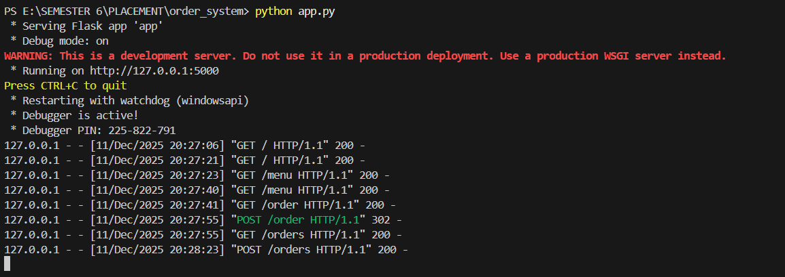

# Order System

Simple Flask-based order management demo app. It provides a small web UI to view a menu, place orders, and review existing orders.





**Features**
- View menu and place orders via a web form.
- Persist orders using the included database helper.
- Minimal, easy-to-read code suitable for learning Flask routing, templates, and simple persistence.

**Prerequisites**
- Python 3.8+
- Recommended: create a virtual environment

**Install**
1. Create and activate a virtualenv (optional but recommended):

	 - Windows (PowerShell):

		 ```powershell
		 python -m venv .venv
		 .\.venv\Scripts\Activate.ps1
		 ```

2. Install dependencies:

	 ```bash
	 pip install -r requirements.txt
	 ```

**Run the app**
- Start directly with Python:

	```bash
	python app.py
	```

- Or with Flask (from project root):

	```powershell
	$env:FLASK_APP = "app.py"
	flask run
	```

Open a browser at http://127.0.0.1:5000 to use the app.

**Project layout**
- `app.py` — Application entrypoint and Flask app initialization.
- `routes.py` — HTTP route handlers.
- `models.py` — Data models (if present) and helpers.
- `database.py` — Database connection / helpers.
- `config.py` — Configuration values.
- `templates/` — Jinja2 templates (`index.html`, `menu.html`, `orders.html`, `place_order.html`).
- `static/` — Static assets (CSS, images).

**Important routes**
- `/` — Home page
- `/menu` — Menu listing
- `/place-order` — Form to submit an order
- `/orders` — View placed orders

**Notes**
- The app uses the included database utilities; on first run it will create the required database file if necessary.
- Adjust `config.py` for environment-specific settings (database path, debug flag, etc.).

**Contributing / Next steps**
- Add input validation and error handling for forms.
- Add unit tests and a simple CI workflow.

**License & contact**
- This project is provided as-is for learning purposes. Open an issue or PR for improvements.

**Author - SUKESH**

